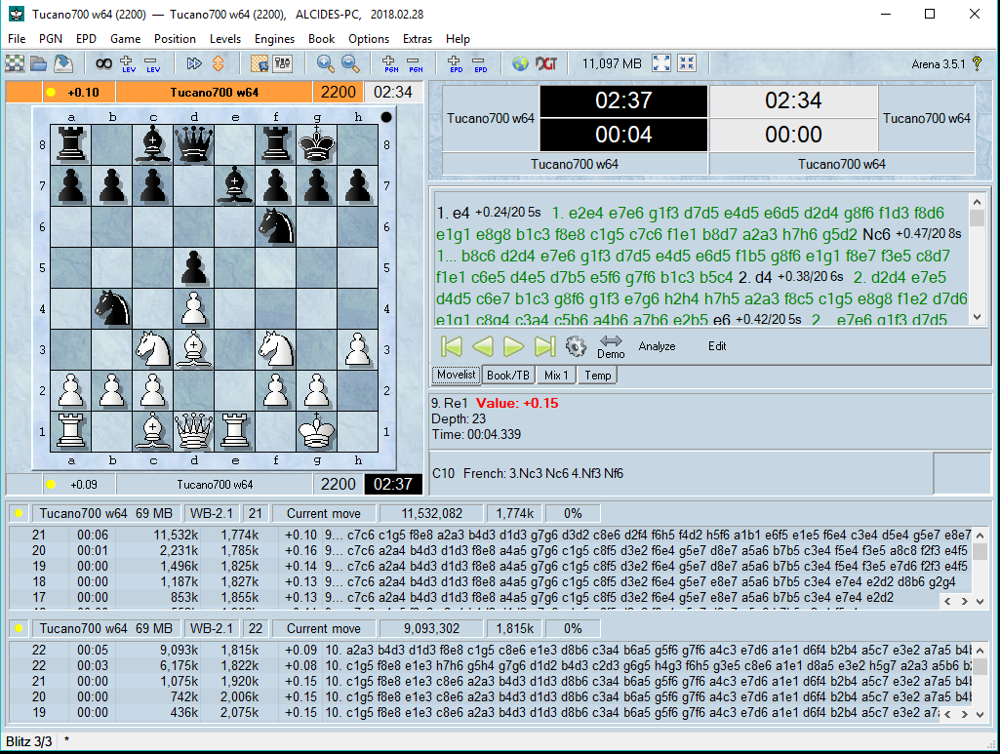

# Tucano
Tucano Chess Engine 

This is my chess engine Tucano (Toucan in english). It is the name of a colorful bird with an oversized bill, and is popular in my country Brazil. 
I'm an IT professional that likes chess and programming, so I combined both with the development of the development of a chess engine. 
I used the information available on the internet, specially, other engines source code, such as fruit, crafty, stockfish, rodent, olithink, sungorus, tscp, etc. 
Thanks to all developers that made this knowledge available.
The main source of information for development of chess engines can is the Chess Programming Wiki Pages (https://www.chessprogramming.org/Main_Page).
In case of any question please send me an email (alcides_schulz@hotmail.com) or stop by talkchess.com.

Tucano can be downloaded from https://sites.google.com/site/tucanochess/ or from github: https://github.com/alcides-schulz/Tucano

Terms of use
------------
Tucano is free, and distributed under the GNU General Public License (GPL). Essentially, this means that you are free to do almost exactly what you want with the program, including distributing it among your friends, making it available for download from your web site, selling it (either by itself or as part of some bigger software package), or using it as the starting point for a software project of your own.

The only real limitation is that whenever you distribute Tucano in some way, you must always include the full source code, or a pointer to where the source code can be found. If you make any changes to the source code, these changes must also be made available under the GPL.

For full details, read the copy of the GPL found in the file named copying.txt.

Notice: this is free software, there is NO warranty; not even for MERCHANTABILITY or FITNESS FOR A PARTICULAR PURPOSE.

Have Fun.

Alcides Schulz.

Running Tucano
--------------
Tucano version 8.00 supports both XBoard and UCI protocols. I recommend using UCI from now on. Future version may not support XBoard anymore.

Syzygy endgame tablebases
-------------------------
Starting on version 8.00, tucano supports syzygy (option SyzygyPath). It leverages Fathom from Jon Dart.

    - Syzygy: endgame tables bases by Ronald de Man
    
    - Fathom: syzygy probing tool by Jon Dart.
    
    
Protocol options
----------------
Tucano supports the following options (version 8.00), same name in both XBoard and UCI protocols:

    option Threads=N
    	N = 1 to 64
    option Hash=N
    	N = 8 to 16384
    option SyzygyPath="F"
    	F = folder where Syzygy end game tablebase is

Command Line options
--------------------
tucano -hash N -threads N -syzygy_path F

   -hash indicates the size of hash table, default = 64 MB, minimum: 8 MB, maximum: 1024 MB.
   
   -threads indicates how many threads to use during search, minimum: 1, maximum: 64. Depends on how many cores you computer have.
   
   -syzygy_path indicates the folder of syzygy endgame tablebase.

   
Signature
---------
If you compile tucano you can use the command "bench" to get a signature. Just start tucano and type "bench". 
Signature is a generated number after searching a couple of positions to indicate you have the correct compilation. 
If you don't get the correct signature it means that something is wrong with the compilation process and the program may not perform correctly.

8.00: 32406478

Compilation
-----------
The main platform used for development is Windows. 
I try to use standard functions and make tucano portable, so it can be compiled on other platforms, but there's no warranty it will work on all of them.
You can report issues with other platforms and I will try to address as possible.

Tucano was compiled for windows using Mingw version 7.2.0.

Note: for syzygy tablebases it is necessary to compile with c99 standard. If you have a compiler that doesn't support c99, you can remove the preprocessor EGTB_SYZYGY, but it will not have the end game tablebase support.

Here are the commands that were used for compilation:

Windows:
gcc -o tucano.exe -DEGTB_SYZYGY -std=c99 -O3 -Isrc -flto -m64 -mtune=generic -s -static -Wall -Wfatal-errors src\*.c src\fathom\tbprobe.c

Linux:
gcc -std=c99 -Wall -Wextra -march=native -g -DEGTB_SYZYGY -O3 -flto -o tucano src/*.c src/fathom/tbprobe.c -lpthread -lm
